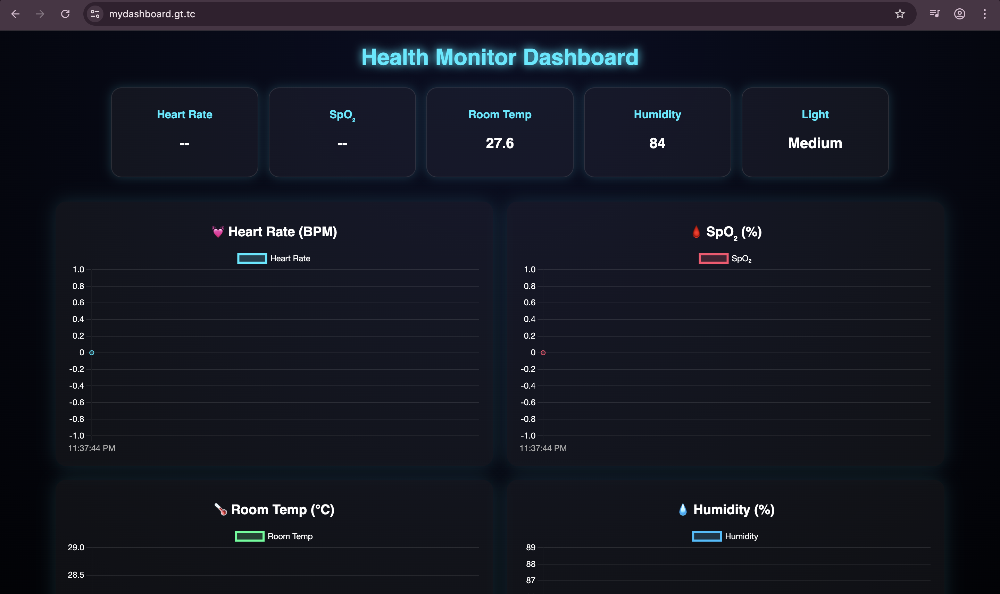

# ESP32 Health Monitor Dashboard

A real-time **IoT Health Monitoring System** using **ESP32**, **Firebase Realtime Database**, and **Chart.js**.

---

## Features
- Real-time health data updates (Heart Rate, SpO₂, Temperature, Humidity, Light)
- Responsive and modern glowing UI
- Live charts using Chart.js
- Firebase integration for instant sensor updates
- Works on mobile and desktop screens

---

## How It Works
1. ESP32 collects sensor data (like MAX30102, DHT11, LDR, etc.).
2. ESP32 uploads readings to Firebase Realtime Database.
3. Web dashboard listens to database changes and updates live charts instantly.

---

## Technologies Used
- **ESP32**
- **Firebase Realtime Database**
- **HTML, CSS, JavaScript**
- **Chart.js (v4)**
- **Firebase JS SDK (v9 modular)**

---
## Screenshots  

** Demo**  
  

** Dashboard : https://mydashboard.gt.tc**  
 

---
## Setup Instructions
1. Clone this repository:
   ```bash
   git clone https://github.com/Balmukund-Maurya/ESP32_Health_Monitor_Dashboard.git
1. To see the Demo Dashboard open the website:
    ```bash
    Website https://mydashboard.gt.tc