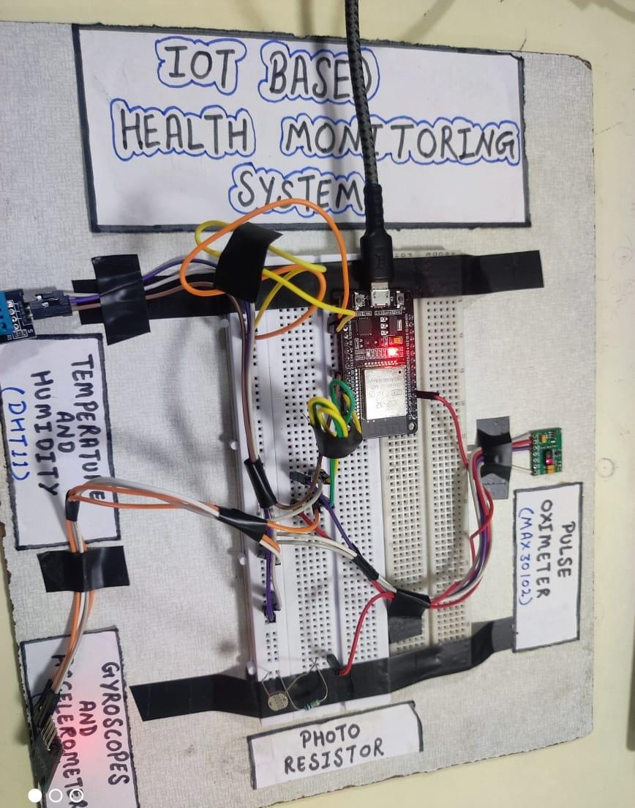

# ESP32 Health Monitoring System

A complete **IoT-based Health Monitoring System** that tracks **Heart Rate, SpO₂, Temperature, Humidity, Light**, and **Fall Detection** using the **ESP32**, and displays real-time data on a **Firebase-powered web dashboard** — with **Telegram alerts** for emergencies.

---

## Overview

This project collects physiological and environmental data using sensors connected to an ESP32, sends them to **Firebase Realtime Database**, and visualizes them through a live web dashboard built with **HTML, JavaScript, and Chart.js**.

---

## Features

 Heart Rate & SpO₂ via **MAX30102**  
 Room Temperature & Humidity via **DHT11**  
 Fall Detection via **MPU6050 (GY-521)**  
 Room Light Intensity via **LDR**  
 Real-time Cloud Sync using **Firebase Realtime Database**  
 Instant Alerts via **Telegram Bot**  
 Web Dashboard with **live graphs** and **glowing dark theme**

---

## Components Used

| Component | Function |
|------------|-----------|
| **ESP32 DevKit V1** | Main microcontroller |
| **MAX30102** | Heart rate & SpO₂ sensor |
| **DHT11** | Temperature & humidity |
| **MPU6050 (GY-521)** | Fall detection |
| **LDR** | Room light intensity |
| **Firebase** | Cloud database |
| **Telegram Bot** | Free alert system |
| **Chart.js** | Live graphs on web dashboard |

---

## Circuit Overview

| Sensor | ESP32 Pin |
|--------|-----------|
| MAX30102 SDA | GPIO 21 |
| MAX30102 SCL | GPIO 22 |
| DHT11 DATA | GPIO 5 |
| MPU6050 SDA | GPIO 21 |
| MPU6050 SCL | GPIO 22 |
| LDR (voltage divider output) | GPIO 34 |

Power all sensors with **3.3V & GND**.  
> Connect all grounds together (common GND).

---

## Firebase Setup

1. Go to [Firebase Console](https://console.firebase.google.com/)
2. Create a new project → Enable **Realtime Database**
3. Copy your **API key** and **Database URL**
4. Replace them in:
   - `ESP32_Health_Monitor.ino`
   - `index.html`

---

## Telegram Alert Setup

1. Open **Telegram** → Search for **BotFather**  
2. Create new bot → copy the **Bot Token**
3. Start a chat with your bot → get your **chat_id** using [@userinfobot](https://t.me/userinfobot)
4. Add both values in your ESP32 code.

---

## Web Dashboard

The `dashboard/index.html` connects to Firebase and displays:
- Live readings  
- Animated glowing graphs (Chart.js)
- Real-time updates without refresh  

You can host it on **GitHub Pages** or open it locally.

**Dashboard Preview:**


**Circuit Preview:**

---

## Example Output

**Firebase Data**
```json
{
  "sensorData": {
    "heartRate": 85,
    "SpO2": 97,
    "temperature": 28.4,
    "humidity": 56,
    "lightLevel": 420,
    "acceleration": 9.82
  }
}


